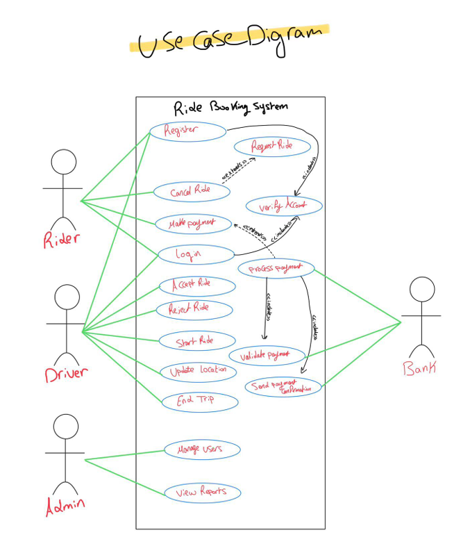
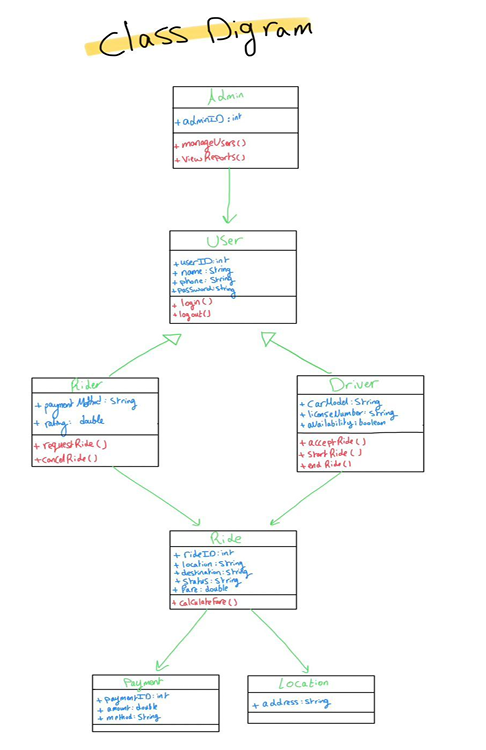
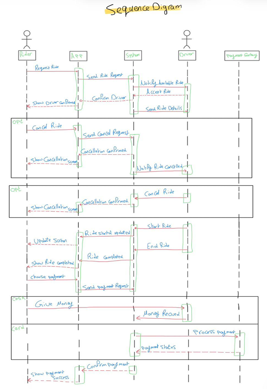
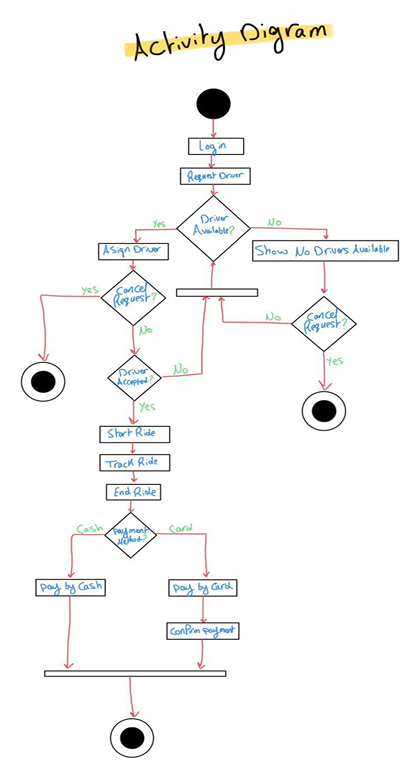
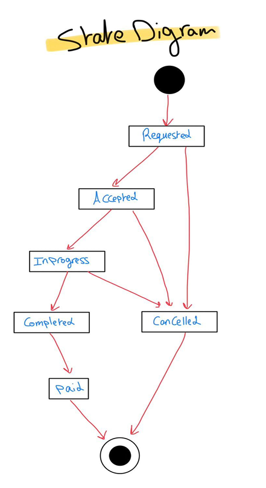

# Ride Booking System (RBS) - Software Requirements Specification

## 📌 Project Overview
The Ride Booking System (RBS) is a mobile-based application that connects riders with drivers for transportation services. It integrates with GPS services, payment gateways, and a cloud database to provide a seamless experience.

## 👥 System Users
1. **Rider:** A basic mobile user who requests rides and pays for the service.
2. **Driver:** A registered and verified user who accepts and completes trips .
3. **Admin:** Has full system access to manage users and track trips.

## ✨ Core System Features
* **User Authentication:** Allows riders and drivers to securely log in.
* **Ride Request:** Allows riders to request a ride, validates driver availability, and calculates the fare.
* **Ride Management:** Handles the complete trip lifecycle from start to finish, including real-time tracking.
* **Payment System:** Handles fare transactions between riders and drivers using secure payment methods integrated through an external payment gateway.

## 📊 System Diagrams
Below are the architectural and behavioral diagrams illustrating the system's design:

### 1. Use Case Diagram

### 2. Class Diagram

### 3. Sequence Diagram

### 4. Activity Diagram

### 5. State Diagram

## ⚙️ Non-Functional Requirements
* **Performance:** The system should respond to user requests within 3 seconds under normal conditions.
* **Security:** User passwords must be encrypted using secure hashing algorithms, and all data communication must use HTTPS.
* **Reliability:** The system is designed to maintain 99.9% uptime. 

## 👨‍💻 Project Team
* Youssef Shaher Shoukry 
* Ibrahim Mahmoud Mohamed 
* Aly Eldeen Ahmed Eldowaik 
* Youssef Mohamed Said 
* Youssef Ahmed Mohamed 
